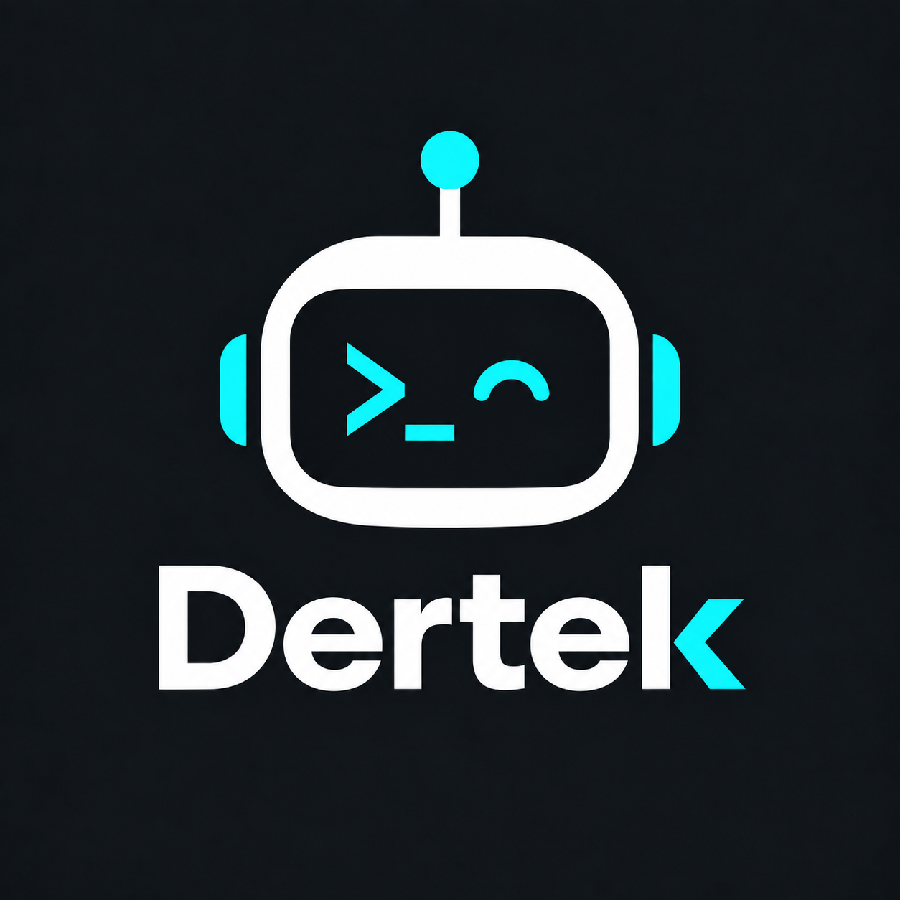

<p align="center">
  
</p>

# Dertek CLI

**Author:** dantebytes

Dertek is an experimental agentic coding CLI built around a **two-speed architecture**:

- **TypeSafe Jev** handles fast, bounded decisions such as task routing.
- A **generative LLM** handles reasoning, code generation, debugging, and final responses.
- Deterministic Python code handles tools, workspace boundaries, policy checks, events, and execution.

`dertek-cli` is intentionally only an interface. The reusable agent lives behind the UI-neutral `dertek.runtime` assembly layer, so a future `dertek-desktop` can reuse the same runtime instead of reimplementing the agent or copying CLI setup.

## Status

This repository is a runnable v0.1 foundation, not a hardened production sandbox. OpenAI is implemented now. Anthropic Claude and Google Gemini are represented in the provider abstraction and are planned, but not implemented yet.

## Prerequisites

Dertek is a Python 3.12+ application. [`uv`](https://docs.astral.sh/uv/getting-started/installation/) is the recommended Python project and dependency manager because this repository uses `pyproject.toml` and `uv.lock`.

Install `uv` with Astral's official standalone installer.

macOS or Linux:

```bash
curl -LsSf https://astral.sh/uv/install.sh | sh
```

Windows PowerShell:

```powershell
powershell -ExecutionPolicy ByPass -c "irm https://astral.sh/uv/install.ps1 | iex"
```

Restart the terminal if the installer updates your `PATH`, then verify:

```bash
uv --version
```

Package-manager alternatives include `brew install uv` on macOS and `winget install --id=astral-sh.uv -e` on Windows. See the official installation page for additional methods.

## Install Dertek

```bash
git clone https://github.com/CodesInTheShell/dertek.git
cd dertek
uv tool install .
dertek version
```

For the first installation, use `uv tool install .` as shown above. After updating an existing clone, reinstall with `--force` so the currently installed Dertek tool is replaced:

```bash
cd /path/to/dertek
git pull
uv tool install --force .
dertek version
```

If `dertek` is not found, run `uv tool list` first. If Dertek is absent, run `uv tool install .` from the clone. If it is installed but not discoverable, run `uv tool update-shell` and restart the terminal. The update-shell command configures `PATH`; it does not install Dertek. See the [installation guide](docs/installation.md) for detailed troubleshooting, updating, and removal.

### Common installation troubleshooting

- **`dertek: command not found`:** check `uv tool list`, then run `uv tool update-shell` and restart the terminal.
- **Recently pulled code is not taking effect:** uv may be reusing a cached local build. Clean and refresh the non-editable installation using the commands in the [installation troubleshooting guide](docs/installation.md#troubleshooting-stale-code-after-an-update).
- **ChatGPT login opens an invalid authorization page:** refresh the installed tool first, then retry `dertek auth login`.

The detailed [installation guide](docs/installation.md) also covers updating, stale package caches, contributor editable installs, credentials, and removal.

## Choose how to authenticate with OpenAI

Dertek supports two explicit OpenAI authentication modes. In both modes, export your TypeSafe key to enable Jev:

```bash
export TYPESAFE_API_KEY="your-typesafe-key"
```

### Option 1: Sign in with ChatGPT

Use this when you want Dertek model calls to use your ChatGPT subscription limits instead of an OpenAI API key:

```bash
dertek auth login
# For SSH, containers, or a headless terminal:
dertek auth login --device-code

dertek auth status
dertek doctor
```

Browser login opens an OpenAI sign-in page. Device login prints a URL and one-time code. A successful login saves `"openai_auth": "chatgpt"` in `~/.dertek/settings.json`, so future `dertek` commands use ChatGPT automatically. To select it for only one command, use `dertek --auth chatgpt`.

Browser login temporarily listens on the registered local callback ports `1455` or `1457`. If both ports are occupied, close the program using them and retry, or use `dertek auth login --device-code`. If you updated Dertek but still see an invalid authorization request, refresh the installed tool with `uv tool install --force .` from the Dertek checkout.

### Option 2: Export an OpenAI API key

Use this when you want normal OpenAI API billing:

```bash
export OPENAI_API_KEY="your-openai-key"
export TYPESAFE_API_KEY="your-typesafe-key"
dertek --auth api-key
```

API-key mode is the built-in default. You can also set `DERTEK_OPENAI_AUTH=api-key`. Dertek never silently switches between API billing and ChatGPT subscription usage.

An installed uv tool reads exported variables from the shell where you start it. It does not automatically read the `.env` file in the Dertek source clone when launched from another project.

### Switch between ChatGPT and API-key authentication

Use `--auth` to select the authentication mode for one run:

```bash
# Use saved ChatGPT credentials for this run:
dertek --auth chatgpt

# Use OPENAI_API_KEY for this run:
export OPENAI_API_KEY="your-openai-key"
dertek --auth api-key
```

The CLI flag does not overwrite your saved default. For a persistent choice, set `openai_auth` in `~/.dertek/settings.json`:

```json
{
  "openai_auth": "chatgpt"
}
```

Use `"api-key"` instead to make API-key authentication the default. Running `dertek auth login` successfully also saves `chatgpt` as the default.

Switching to API-key mode does not delete your ChatGPT OAuth credentials. They remain owner-only in `~/.dertek/auth/openai.json`, allowing you to switch back later with `dertek --auth chatgpt`. To remove the saved ChatGPT credentials completely, run:

```bash
dertek auth logout
```

Logout removes the OAuth credentials but does not provide or configure an API key. Export `OPENAI_API_KEY` and select `api-key` before the next run. Check the active mode and credential status with `dertek doctor` and `dertek auth status`.

## Use Dertek in a project

Run Dertek from the project you want it to work on:

With ChatGPT sign-in already completed:

```bash
cd /path/to/another-project
export TYPESAFE_API_KEY="your-typesafe-key"
dertek --auth chatgpt
# After login has saved the setting, plain `dertek` uses ChatGPT too:
dertek
```

Or with API-key authentication:

```bash
cd /path/to/another-project
export OPENAI_API_KEY="your-openai-key"
export TYPESAFE_API_KEY="your-typesafe-key"
dertek --auth api-key
```

The current directory becomes the workspace. Alternatively, use `--workspace` or `-C` without changing directories:

```bash
dertek -C /path/to/another-project "explain this project"
```

Configure the two LLM tiers in `.env` or `~/.dertek/settings.json`:

```env
DERTEK_SMALL_MODEL=gpt-5.6-luna
DERTEK_SMALL_REASONING_EFFORT=high
DERTEK_LARGE_MODEL=gpt-5.6-terra
DERTEK_LARGE_REASONING_EFFORT=low
```

Dertek creates `~/.dertek/settings.json` the first time you run a command such as `dertek doctor`. You can then edit it with non-secret defaults. A ready-to-use example is:

```json
{
  "provider": "openai",
  "openai_auth": "chatgpt",
  "small_model": "gpt-5.6-luna",
  "small_reasoning_effort": "high",
  "large_model": "gpt-5.6-terra",
  "large_reasoning_effort": "low",
  "router_high_confidence": 0.9,
  "router_medium_confidence": 0.65,
  "max_steps": 12,
  "max_jev_calls_per_turn": 4,
  "small_model_step_limit": 2,
  "jev_verification_enabled": true,
  "shell_timeout_seconds": 120,
  "approval_mode": "on-request"
}
```

Use `"openai_auth": "chatgpt"` after `dertek auth login`, or `"openai_auth": "api-key"` with an exported `OPENAI_API_KEY`. Use `settings.json` for non-secret defaults you want on every run, such as authentication mode, models, reasoning effort, routing thresholds, and approval mode. Use CLI flags for temporary per-command overrides. Never put API keys or OAuth tokens in `settings.json`.

Approval modes control shell authorization:

- `on-request` (default) asks before potentially modifying or ambiguous shell commands.
- `never` denies those commands instead of asking, which suits fail-closed read-only CI checks.
- `auto` runs commands that would normally ask, without pausing for input; deterministic dangerous-command denials still apply.

For a one-off unattended run:

```bash
dertek --approval-mode auto "run the tests and complete the requested task"
```

**Caution:** Auto-approved shell commands are not sandboxed and run with the permissions of the Dertek process. Use `auto` only with trusted repositories, preferably inside an isolated CI runner or container. Tool failures, timeouts, model errors, safety denials, and execution limits can still prevent completion. See [Security: approval modes](docs/security.md#approval-modes).

Dertek deliberately gives Luna `high` reasoning for inexpensive small tasks and Terra `low` reasoning for the main large-task path. The Responses API field is `reasoning: {"effort": "..."}`; valid Terra/Luna values are `none`, `low`, `medium`, `high`, `xhigh`, and `max`.

Jev selects `small` for narrow, well-defined, low-risk requests and `large` for coding, debugging, modification, ambiguous, or multi-step work. A missing Jev key or low-confidence model decision always falls back to the large model. The original `DERTEK_MODEL` and `--model` remain supported as legacy large-model overrides.

One-shot usage:

```bash
dertek "find the User model and explain it"
dertek "run the tests and explain any failures"
```

## Local state and sessions

Dertek creates owner-only local state at `~/.dertek/`:

```text
~/.dertek/
├── settings.json       # non-secret defaults, including openai_auth
├── auth/
│   └── openai.json     # owner-only ChatGPT OAuth credentials
└── sessions/
    └── <session-id>.json
```

Installation alone does not create this directory. The first command that initializes local state—such as `dertek doctor`, `dertek`, or `dertek sessions list`—creates it. Each agent invocation creates a persisted session. The session file contains the workspace, continuation metadata, prompts, responses, tool calls, approval decisions, and raw tool output so a future desktop can restore the timeline. Treat it as sensitive local data. API keys and OAuth tokens are never saved there. In v0.1, ChatGPT's `store: false` replay buffer is process-local, so resuming after restarting Dertek restores the transcript but does not yet recreate the model's complete prior context.

```bash
dertek --session <session-id>
dertek sessions list
dertek sessions delete <session-id>
```

Configuration priority is CLI flags, then `DERTEK_*` environment variables, then `~/.dertek/settings.json`, then built-in defaults. Use settings for persistent non-secret choices and CLI flags for temporary overrides. API keys stay in exported variables; ChatGPT OAuth credentials stay in `~/.dertek/auth/openai.json`.

See [`docs/configuration.md`](docs/configuration.md) for the complete default JSON, environment-variable mapping, first-run behavior, and provider support.

Useful commands:

```bash
dertek doctor
dertek auth login
dertek auth login --device-code
dertek auth status
dertek auth logout
dertek models --auth chatgpt
dertek version
dertek --help
```

## Router behavior

When `TYPESAFE_API_KEY` is configured, Jev controls bounded decisions while Luna and Terra perform generative work. Intake selects the route, workflow, tool profile, model tier, and verification level in one batched request. Event-driven checkpoints may escalate Luna to Terra after failures, mutations, scope expansion, or the small-model step limit. Final verification runs only when it can change the outcome. Routes are:

- `chat`
- `code`
- `debug`
- `search`
- `command`

Confidence gates are applied by Dertek itself:

- **High confidence**: use the route strongly and expose a focused tool set.
- **Medium confidence**: treat the route as a hint and let the main LLM verify it naturally.
- **Low confidence**: do not constrain the main LLM with the route.

If TypeSafe is not configured or temporarily fails, Dertek falls back to a small deterministic heuristic router so the CLI remains usable.

Dertek makes at most four Jev calls per turn: one intake, up to two meaningful checkpoints, and optional verification. Successful routine read-only tools do not add Jev calls. Jev decisions never replace deterministic security policy.

## Current tools

- `read_file`
- `list_files`
- `search_files`
- `shell`
- `apply_patch`
- `git_diff`

`apply_patch` is Git-independent. It accepts standard unified diffs and Dertek
`*** Begin Patch` blocks. Unified diffs use `git apply --check` followed by
`git apply` when the workspace is a Git worktree; all Dertek patches, non-Git
workspaces, and environments without Git use the internal UTF-8 text patcher.
Neither path stages files or creates commits.

## Security model

v0.1 provides workspace path guards, deterministic command policy checks, and user approval for shell commands that are not verified as direct read-only commands. It is **not an OS sandbox**. See [`docs/security.md`](docs/security.md) before using Dertek on sensitive machines or repositories.

## Documentation

Start with:

- [`docs/installation.md`](docs/installation.md)
- [`docs/architecture.md`](docs/architecture.md)
- [`docs/configuration.md`](docs/configuration.md)
- [`docs/router.md`](docs/router.md)
- [`docs/providers.md`](docs/providers.md)
- [`docs/security.md`](docs/security.md)
- [`docs/development.md`](docs/development.md)
- [`docs/desktop-roadmap.md`](docs/desktop-roadmap.md)

## Development

The global tool installation is for normal use. Contributors should use the repository environment:

```bash
uv sync --group dev
uv run pytest
uv run ruff check .
```

## Why direct Responses API?

Dertek deliberately owns its agent loop, tool dispatch, state, hooks, and routing. This keeps the architecture provider-neutral and gives us a clean place to integrate Jev decisions before and after expensive model calls.
